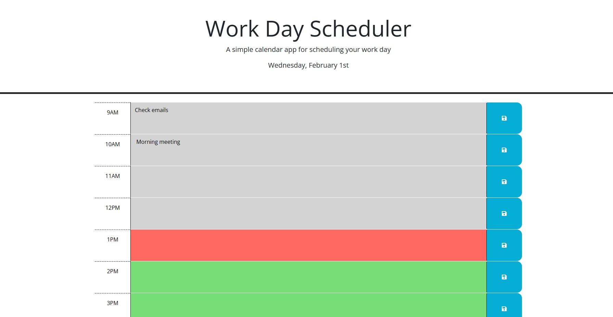
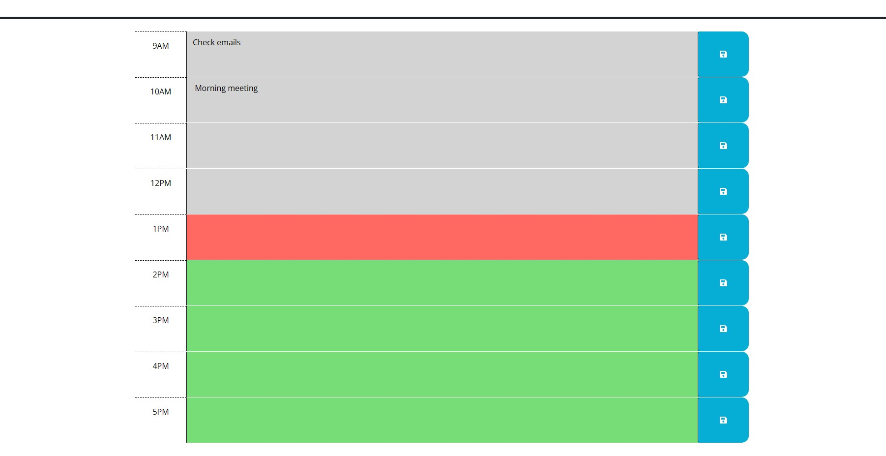

# Work-Day-Scheduler

## Description

This website was created as a tool to help users with scheduling their regular work day. The purpose is to help with organization.

Screenshots as follows:

[Password Generator Webpage](https://jmcdlungren.github.io/Work-Day-Scheduler/)

[GitHub Repository Link](https://github.com/jmcdlungren/Work-Day-Scheduler)

## Usage

The user can enter in any tasks for the regular work day from 9am to 5pm and save the information. The items are then stored so that when the user refreshes the page, the tasks will still be visible.

## Credits

N/A

## License

Please refer to the LICENSE in the repo.